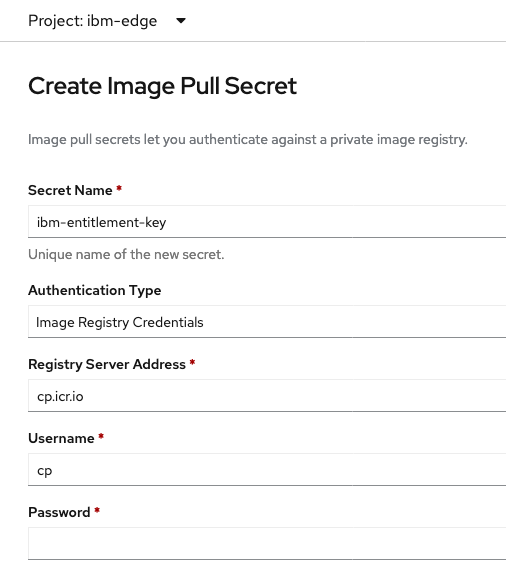
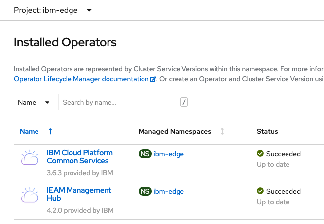
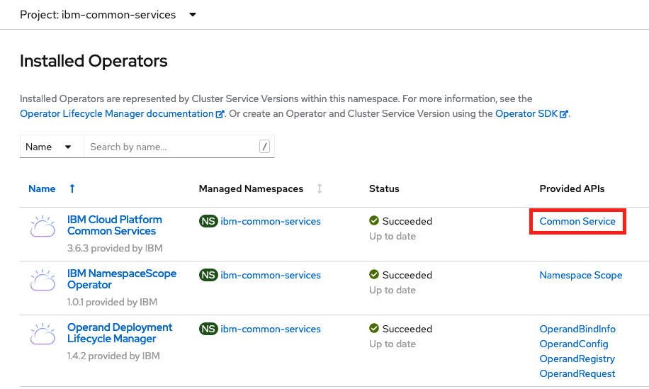
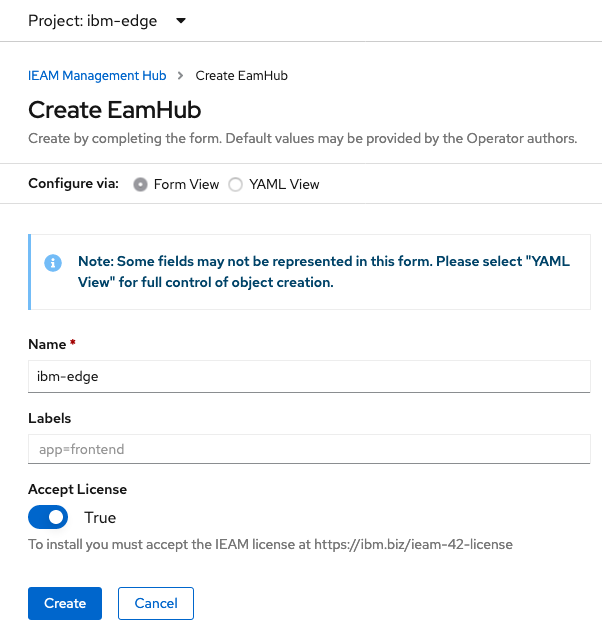

# Install IBM Edge Application Manager

**Description**: This guide will install IBM Edge Application Manager 4.2 on OpenShift 4.5.  

## Table of Contents
- [Pre-requisites](#pre-requisites)
- [Configure Operator Catalog](#configure-operator-catalog-sources)
- [Create Secret for Entitlement Key](#create-secret-for-entitlement-key)
- [Install IEAM 4.2](#install-ieam)
- [Post Installation Validation](#post-installation-validation)


# Pre-requisites:
The instructions below assumes that the following conditions have been met.  Instructions are also available on the [IBM Knowledge Center](https://www.ibm.com/support/knowledgecenter/SSFKVV_4.2/hub/online_installation.html).
- An instance of OpenShift 4.5 has been provisioned.
- An `ibm-entitlement-key` to authenticate to the IBM Entitled Registry.  
- Storageclass(es) available to provision storage.


# Configure Operator Catalog Sources
1. Log in to the OpenShift Web Console.
2. From the OpenShift Console, select the `Import YAML` button, paste in the yaml for the IBM Operator Catalog Source and click `Create`.
```
apiVersion: operators.coreos.com/v1alpha1
kind: CatalogSource
metadata:
  name: ibm-operator-catalog
  namespace: openshift-marketplace
spec:
  displayName: IBM Operator Catalog
  publisher: IBM
  sourceType: grpc
  image: docker.io/ibmcom/ibm-operator-catalog:latest
  updateStrategy:
    registryPoll:
      interval: 45m
```
3. From the OpenShift Console, select the `Import YAML` button, paste in the yaml for the IBM Common Services Catalog Source and click `Create`.
```
apiVersion: operators.coreos.com/v1alpha1
kind: CatalogSource
metadata:
  name: opencloud-operators
  namespace: openshift-marketplace
spec:
  displayName: IBMCS Operators
  publisher: IBM
  sourceType: grpc
  image: quay.io/opencloudio/ibm-common-service-catalog:latest
  updateStrategy:
    registryPoll:
      interval: 45m
```


# Create Secret for Entitlement Key
1. From the OpenShift Console, select Home > Projects.  Create a new project called `ibm-edge`
2. Create a secret containing the IBM Entitlement Key to authenticate and pull images from the IBM Entitled Registry.  Paste the Entitlement Key into the `Password` parameter. 



# Install IEAM
1. From the OpenShift Console, select Operators > OperatorHub and search for `IEAM Management Hub` and click `Install`.
2. Ensure the `Installed Namespace` parameter is set to `ibm-edge` and click `Install`.
3. Wait for the `IBM Cloud Platform Common Services` and `IEAM Management Hub` operators to show up and in a `Succeeded` status.

4. A new project `ibm-common-services` should have been created.  Switch to this project and select the `Common Service` link under the column `Provided APIs`.  

5. Select the `common-service` custom resource, browse to the `YAML` tab and replace `spec:` field with the following yaml snippet.  Click `Save`.
```
spec:
  size: medium
  services:
  - name: ibm-management-ingress-operator
    spec:
      managementIngress:
        replicas: 3
  - name: ibm-mongodb-operator
    spec:
      mongoDB:
        resources:
          requests:
            cpu: 500m
            memory: 2000Mi
  - name: ibm-monitoring-prometheusext-operator
    spec:
      prometheusExt:
        prometheusConfig:
          resource:
            requests:
              cpu: 160m
              memory: 2500Mi
```
6. Switch back to the `ibm-edge` project, browse to `Operators > Installed Operators` and select `EamHub` link under the column `Provided APIs`.
7. Click the `Create EamHub` button and ensure `Accept LIcense` is set to `True`.  Click `Create`.

8. The operator will deploy the required workloads to create the IEAM Hub.  


# Post Installation Validation
1. Monitor the status of the pods in the `ibm-edge` and `ibm-common-services` projects and ensure the pods are in a Completed or Running state.
2. Download the [IEAM Agent package](https://www.ibm.com/support/knowledgecenter/SSFKVV_4.2/hub/part_numbers.html?view=kc) and extract the .tar.gz file.
```
tar -zxvf ibm-eam-4.2.0-agent-x86_64.tar.gz && \
cd ibm-eam-4.2.0-agent-x86_64/tools
```
3. Validate the installation using the `service_healthcheck.sh` script.
```
./service_healthcheck.sh
==Running verification tests against IBM Edge Application Manager==
[1/12]
SUCCESS: IBM Edge Application Manager Exchange API is operational
SUCCESS: IBM Edge Application Manager Cloud Sync Service is operational
SUCCESS: IBM Edge Application Manager Agbot heartbeat is current
SUCCESS: IBM Edge Application Manager SDO API is operational
SUCCESS: IBM Edge Application Manager UI is operational
==All IBM Edge Application Manager services are up and running==
```
