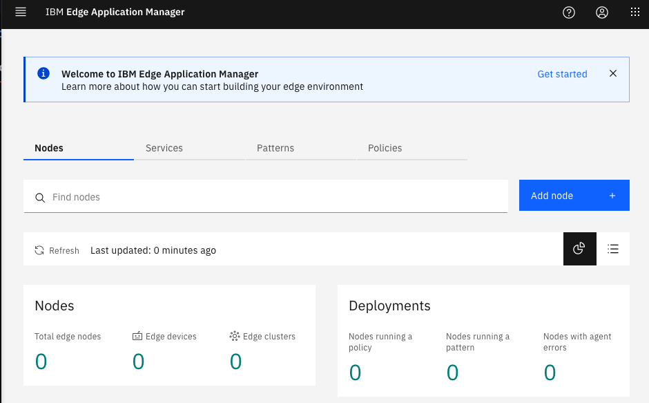

# Post Install Configuration for IBM Edge Application Manager

**Description**: This guide will perform the required post-install configuraiton for IBM Edge Application Manager 4.2 on OpenShift 4.5.  

## Table of Contents
- [Pre-requisites](#pre-requisites)
- [Post Installation Configuration](#post-installation-configuration)


# Pre-requisites:
The instructions below assumes that the following conditions have been met.  Instructions are also available on the [IBM Knowledge Center](https://www.ibm.com/support/knowledgecenter/SSFKVV_4.2/hub/online_installation.html).
- An instance of OpenShift 4.5 has been provisioned.
- IBM Edge Application Manager Operator has been installed and an IEAM Hub has been created.


# Post Installation Configuration
1. In the [IEAM Post Installation Validation](https://github.com/hollisc/Exploring-Edge/blob/main/IEAM/IEAM-Install.md#post-installation-validation) step, the [IEAM Agent package](https://www.ibm.com/support/knowledgecenter/SSFKVV_4.2/hub/part_numbers.html?view=kc) .tar.gz has been downloaded and extracted.  
2. Extract the agent files and install the Horizon `hzn` CLI.
```
cd ibm-eam-4.2.0-agent-x86_64/agent && \
tar -zxvf edge-packages-4.2.0.tar.gz

# Debian Linux
sudo apt-get install ./edge-packages-4.2.0/linux/deb/amd64/horizon-cli*.deb

# RedHat Linux
sudo dnf install -yq ./edge-packages-4.2.0/linux/rpm/x86_64/horizon-cli-*.x86_64.rpm

# macoS:
sudo security add-trusted-cert -d -r trustRoot -k /Library/Keychains/System.keychain edge-packages-4.2.0/macos/pkg/x86_64/horizon-cli.crt && \
sudo installer -pkg edge-packages-4.2.0/macos/pkg/x86_64/horizon-cli-*.pkg
```
3. Create an initialize your first Organization within the IEAM Hub.  
```
cd ../tools
./post_install.sh edge-sample-org

### Sample output ###
Initialize the 'edge-sample-org' org with the default IAM account and publish IBM examples to the exchange? This will result in a brief SDO outage and UI restart[y/N]:
y
Checking local installation environment prerequisites...
PASSED: Prerequisite check completed successfully
Gathering cluster information
Creating org 'edge-sample-org'
Organization edge-sample-org is successfully added to the Exchange.
Agbot IBM/agbot is responsible for deploying services in org edge-sample-org
PASSED: Org added successfully
Pre-loading the 'edge-sample-org' with the 'admin' user, and granting them exchange 'admin' permissions
PASSED: Admin user loaded successfully
Patching the 'ibm-edge-auth' secret, defining the 'sdo-org'
secret/ibm-edge-auth patched
PASSED: Org added to secret ibm-edge-auth
Serving patterns from the agbot to the 'edge-sample-org' org
PASSED: Patterns served successfully
Publishing examples
Using examples repo branch v2.27 derived from the hzn version
Cloning https://github.com/open-horizon/examples.git to /tmp/open-horizon/examples ...
Switching to branch v2.27 ...
Branch 'v2.27' set up to track remote branch 'v2.27' from 'origin'.
Publishing services and patterns of edge/services/cpu_percent to IBM org...
Publishing services and patterns of edge/services/gps to IBM org...
Publishing services and patterns of edge/services/helloworld to IBM org...
Publishing deployment policy of edge/services/helloworld to edge-sample-org org...
Publishing services and patterns of edge/services/helloMMS to IBM org...
Publishing services and patterns of edge/services/hello-operator to IBM org...
Publishing deployment policy of edge/services/hello-operator to edge-sample-org org...
Publishing services and patterns of edge/evtstreams/cpu2evtstreams to IBM org...
Publishing deployment policy of edge/evtstreams/cpu2evtstreams to edge-sample-org org...
Successfully published all examples to the exchange. Removing /tmp/open-horizon/examples directory.

SUCCESS: All tasks completed successfully
```
4. Retrieve the IEAM Management Console URL.
```
echo https://$(oc get cm management-ingress-ibmcloud-cluster-info -o jsonpath='{.data.cluster_ca_domain}')/edge
```
5. Retrieve the `admin` password.
```
oc get secrets -n ibm-common-services platform-auth-idp-credentials -o jsonpath='{.data.admin_password}' | base64 --decode && echo
```
6. Log in to the IEAM Management Portal with the `admin` credentials.

