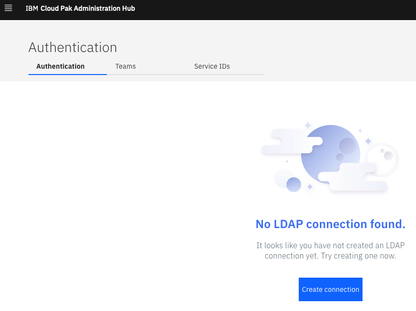

# Deploy and Configure OpenLDAP

**Description**: This guide will deploy OpenLDAP and configure OpenLDAP as an identity provider for IBM Edge Application Manager Hub.


## Table of Content
- [Pre-requisites](#pre-requisites)
- [Configure and deploy OpenLDAP and phpLDAPadmin](#configure-and-deploy-openldap-and-phpldapadmin)
- [Configure IEAM Hub](#configure-ieam-hub)


# Pre-requisites:
The instructions below assumes that the following conditions have been met.  
- An instance of OpenShift 4.5 has been provisioned.


## Configure and deploy OpenLDAP and phpLDAPadmin on OpenShift
1. The [openldap-helm-template.yaml](../openldap-helm-template.yaml) was generated from a Helm Chart and is set up to create two groups (`edgeusers` and `edgeadmins`).  Additionally, `user1 - user4` will be created as users in the `edgeusers` group and `admin1 - admin2` will be created as users in the `edgeadmins` group.  
2. Log in to the OpenShift instance where IEAM is installed.
```
oc login --token=<token> --server=<server>
```
3. Create the `openldap` project/namespace.
```
oc new-project openldap
```
4. Deploy OpenLDAP and phpLDAPadmin.
```
oc apply -f openldap-helm-template.yaml
```
5. Verify the `openldap` and `openldapadmin` pods are in a `Running` state.
```
oc get pods
```
6. Create a route and verify access to the phpLDAPadmin console.  The URL should be similar to `http://openldap-admin-openldap.<OCP server>/`
```
oc expose svc openldap-admin
oc get route
```
7. Log in as the admin using the credentials: `cn=admin,dc=tsa,dc=edge,dc=demo,dc=com` / `edgeadmin`.  Verify the 2 groups and 6 users are listed.  

8. Add additional groups or users based on your requirements.


## Configure IEAM Hub
1. Switch to the `ibm-edge` project where IEAM Hub is deployed.
```
oc project ibm-edge
```
2. Retrieve the IEAM Dashboard URL.
```
echo https://$(oc get cm management-ingress-ibmcloud-cluster-info -o jsonpath='{.data.cluster_ca_domain}')/edge
```
3. Retrieve the `admin` password.
```
oc get secrets -n ibm-common-services platform-auth-idp-credentials -o jsonpath='{.data.admin_password}' | base64 --decode && echo
```
3. Access the IEAM Dashboard from a browser using the admin credentials.  From the hamburger button, select Administer > Identity and Access.

4. Determine the IP address of the `openldap-xxxxxxxxxx-xxxxx` pod.
```
oc get pods -n openldap -o wide
```
5. Create a connection to the OpenLDAP pod.  Select the `Create Connection` button and set the following parameters.  Verify the `Test connection` is successful and click `Create`.
```
Connection Name: OpenLDAP
Server Type: custom
Base DN: dc=tsa,dc=edge,dc=demo,dc=com
Bind DN: cn=admin,dc=tsa,dc=edge,dc=demo,dc=com
Bind DN Password: edgeadmin
URL: ldap://<OpenLDAP server IP address>:389
Group Filter: (&(cn=%v)(objectclass=groupOfUniqueNames))
User filter: (&(uid=%v)(objectclass=inetOrgPerson))
Group ID map: *:cn
User ID map: *:uid
Group member ID map: groupOfUniqueNames:uniqueMember
```

An `OpenLDAP` instance should now be listed on the `Authentication` tab.  
7. Create a team called `edgeadmins`, add the `adminX` users and click `Create`.
```
Team Name: edgeadmins
Domain: OpenLDAP
Select Users option and search for "admin".  Select the "admin1" and "admin2" users and assign the "Administrator" role.
```

8. Create a team called `edgeusers`, add the `userX1` users and click `Create`.
```
Team Name: edgeusers
Domain: OpenLDAP
Select Users option and search for "user".  Select "user1" - "user4" users and assign the "Editor" role.
```

9. Log in to the IEAM Management Console with `admin1` / `edgeadmin` to verify the OpenLDAP integration.

